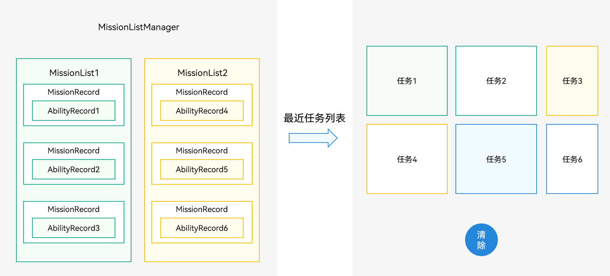

# 任务（Mission）管理场景介绍


任务（Mission）管理相关的基本概念如下：


- AbilityRecord：系统服务侧管理一个UIAbility实例的最小单元，对应一个应用侧的UIAbility组件实例。系统服务侧管理UIAbility实例数量上限为512个。

- MissionRecord：任务管理的最小单元。一个MissionRecord中仅有一个AbilityRecord，即一个UIAbility组件实例对应一个单独的任务。

- MissionList：一个从桌面开始启动的任务列表，记录了任务之间的启动关系，上一个任务由下一个任务启动，最底部的任务由桌面启动，这里称之为任务链。

- MissionListManager：系统任务管理模块，内部维护了当前所有的任务链，与最近任务列表保持一致。
  
  **图1** 任务管理示意图  
  


任务的管理由系统应用（如桌面应用）负责，三方应用无法管理任务。用户通过最近任务列表进行任务的相关交互。当创建任务后，用户可以对最近任务列表进行如下操作：


- 删除一个指定的任务。

- 加锁或解锁一个指定的任务（加锁后的任务在清理所有任务时不会被清理）。

- 清理最近任务列表中的所有任务。

- 将一个指定的任务切换到前台。


一个UIAbility实例对应一个单独的任务，因此应用调用[`startAbility()`](../reference/apis/js-apis-inner-application-uiAbilityContext.md#uiabilitycontextstartability)方法启动一个UIAbility时，就是创建了一个任务。

1. 桌面应用调用[missionManager](../reference/apis/js-apis-application-missionManager.md)的接口管理任务，需要申请`ohos.permission.MANAGE_MISSIONS`权限，配置方式请参见[配置文件权限声明](../security/accesstoken-guidelines.md#配置文件权限声明)。

2. 利用missionManager进行任务管理（监听任务变化、获取任务信息、获取任务快照、清理任务、任务加锁/解锁等）。

   ```ts
   import missionManager from '@ohos.app.ability.missionManager'
   
   let listener = {
     // 任务创建
     onMissionCreated: function (mission) {
       console.info("--------onMissionCreated-------")
     },
     // 任务销毁
     onMissionDestroyed: function (mission) {
       console.info("--------onMissionDestroyed-------")
     },
     // 任务快照变化
     onMissionSnapshotChanged: function (mission) {
       console.info("--------onMissionSnapshotChanged-------")
     },
     // 任务被移动到前台
     onMissionMovedToFront: function (mission) {
       console.info("--------onMissionMovedToFront-------")
     },
     // 任务图标变化
     onMissionIconUpdated: function (mission, icon) {
       console.info("--------onMissionIconUpdated-------")
     },
     // 任务名称变化
     onMissionLabelUpdated: function (mission) {
       console.info("--------onMissionLabelUpdated-------")
     },
     // 任务实例被关闭
     onMissionClosed: function (mission) {
       console.info("--------onMissionClosed-------")
     }
   };
   
   // 1.注册任务变化通知
   let listenerId = missionManager.on('mission', listener);
   
   // 2.获取系统最近20个任务
   missionManager.getMissionInfos("", 20, (error, missions) => {
     console.info("getMissionInfos is called, error.code = " + error.code);
     console.info("size = " + missions.length);
     console.info("missions = " + JSON.stringify(missions));
   });
   
   // 3.获取单个任务的详细信息()
   let missionId = 11; // 11只是示例，实际是从系统中获取的任务id，下面类似
   let mission = missionManager.getMissionInfo("", missionId).catch(function (err) {
     console.info(err);
   });
   
   // 4.获取任务快照
   missionManager.getMissionSnapShot("", missionId, (error, snapshot) => {
     console.info("getMissionSnapShot is called, error.code = " + error.code);
     console.info("bundleName = " + snapshot.ability.bundleName);
   })
   
   // 5.获取低分辨任务快照
   missionManager.getLowResolutionMissionSnapShot("", missionId, (error, snapshot) => {
     console.info("getLowResolutionMissionSnapShot is called, error.code = " + error.code);
     console.info("bundleName = " + snapshot.ability.bundleName);
   })
   
   // 6.加锁/解锁任务
   missionManager.lockMission(missionId).then(() => {
     console.info("lockMission is called ");
   });
   
   missionManager.unlockMission(missionId).then(() => {
     console.info("unlockMission is called ");
   });
   
   // 7.把任务切到前台
   missionManager.moveMissionToFront(missionId).then(() => {
     console.info("moveMissionToFront is called ");
   });
   
   // 8.删除单个任务
   missionManager.clearMission(missionId).then(() => {
     console.info("clearMission is called ");
   });
   
   // 9.删除全部任务
   missionManager.clearAllMissions().catch(function (err) {
     console.info(err);
   });
   
   // 10.解注册任务变化通知
   missionManager.off('mission', listenerId, (error) => {
     console.info("unregisterMissionListener");
   })
   ```

   
