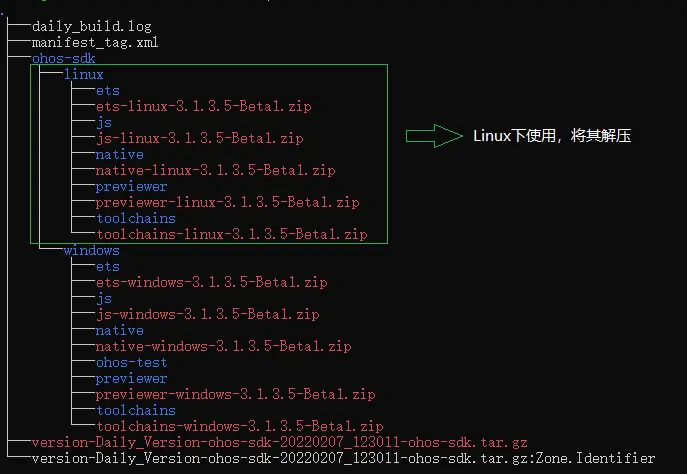

# 如何在CMake工程中使用OpenHarmony SDK的Native API(NDK)

## 什么是Native API

请参看[Native API](../reference/native-api-intro.md)

## 如何下载Native API开发包（NDK）

1. 推荐OpenHarmony正式发布的SDK包 ，下载链接可以从OpenHarmony正式发布版本的[release-notes](../../release-notes/OpenHarmony-v3.2-release.md)中获取，点击release notes中【从站点镜像获取】章节下载。

2. IDE OpenHarmony SDK Manager中下载

3. 从每日构建中下载，下载地址 http://ci.openharmony.cn/workbench/cicd/dailybuild/dailylist ，形态组件选择ohos-sdk


## 解压Native API开发包

下载完成之后，将压缩包放入自己创建好的文件夹下解压，解压完成效果如下图所示：


配置Linux下的环境，如果只是在IDE中使用，跳过下面几步：

将NDK自带的cmake编译工具添加到环境变量中

```
    #打开.bashrc文件
    vim ~/.bashrc
    #在文件最后添加cmake路径，该路径是自己的放置文件的路径，之后保存退出
    export PATH=~/ohos-sdk/ohos-sdk/linux/native/build-tools/cmake/bin:$PATH
    #在命令行执行source ~/.bashrc使环境变量生效
    source ~/.bashrc
```

查看cmake默认路径

```
    #在命令行输入which cmake
    which cmake
    #结果，和自己设置的路径一样
    ~/ohos-sdk/ohos-sdk/linux/native/build-tools/cmake/bin/cmake
```

## 如何使用Native API开发包编译一个native程序

应用开发者可以通过Native API开发包快速的开发出native动态库，静态库与可执行文件，ArkUI应用程序框架可以通过NAPI框架调用到native的动态库中。开发包提供CMake作为官方的编译构建工具。下面通过自己编写一个C/C++ demo工程来演示如何使用Native API开发包来编译C/C++动态库。

### NDK中的文件夹简介

#### build目录中工具链文件ohos.toolchain.cmake

cmake编译时需要读取该文件中的默认值，比如编译器架构、C++库链接方式等，这个需要在编译时通过CMAKE_TOOLCHAIN_FILE指出该文件的路径，便于cmake在编译时定位到该文件。在编译的时候需要为cmake指定参数来控制编译目标的属性，具体要指定的参数在下面的[命令行构建](#命令行构建)会具体介绍。

#### build-tools文件夹放的是NDK提供的编译工具

```
    #键入下一行命令查看cmake的版本
    cmake -version
    #结果
    cmake version 3.16.5

    CMake suite maintained and supported by Kitware (kitware.com/cmake).
```

#### llvm文件夹放的是NDK提供的编译器


### NDK使用的简单demo

#### demo目录图

```
    demo
      ├── CMakeLists.txt
      ├── include
           └── sum.h
      └── src
           ├── CMakeLists.txt
           ├── sum.cpp
           └── hello.cpp
```

#### CMakeLists.txt内容

```
    # 指定cmake的最小版本
    CMAKE_MINIMUM_REQUIRED(VERSION 3.16)

    # 工程名称，这里我们就叫HELLO
    PROJECT(HELLO)

    #添加一个子目录并构建该子目录。
    ADD_SUBDIRECTORY(src bin)
```

#### 内部CMakeLists.txt内容

```
    SET(LIBHELLO_SRC hello.cpp)

    # 设置编译参数
    SET(CMAKE_CXX_FLAGS "${CMAKE_CXX_FLAGS} -O0")   
 
    # 设置链接参数，具体参数可以忽略，纯粹为了举例
    SET(CMAKE_EXE_LINKER_FLAGS "${CMAKE_EXE_LINKER_FLAGS} -Wl,--emit-relocs --verbose")    

    # 添加一个libsum动态库目标，编译成功会生成一个libsum.so
    ADD_LIBRARY(sum SHARED sum.cpp)

    # 生成可执行程序，添加一个Hello的可执行程序目标，编译成功会生成一个Hello可执行程序
    ADD_EXECUTABLE(Hello ${LIBHELLO_SRC})

    # 指定Hello目标include目录路径
    TARGET_INCLUDE_DIRECTORIES(Hello PUBLIC ../include)

    # 指定Hello目标需要链接的库名字
    TARGET_LINK_LIBRARIES(Hello PUBLIC sum)
```

详细CMake手册参考 https://cmake.org/cmake/help/v3.16/guide/tutorial/

#### 源码内容

hello.cpp 源码

```
    #include <iostream>
    #include "sum.h"

    int main(int argc,const char **argv)
    {
        std::cout<< "hello world!" <<std::endl;
        int total = sum(1, 100);
        std::cout<< "Sum 1 + 100=" << total << std::endl;
        return 0;
    }
```

sum.h源码

```
    int sum(int a, int b);

```

sum.cpp源码

```
    #include <iostream>
    
    int sum(int a, int b)
    {
        return a + b;
    }
```

### ohos.toolchain.cmake中关键变量

| 参数   | 类型 |备注|
|--------|------|------|
|OHOS_STL|c++_shared/c++_static|默认是c++_shared，用来控制是动态链接libc++_shared.so还是静态链接libc++_static.a，对于同一个应用中的全部native库需要采用同一种链接方式，这个是由c++运行时中一些全局状态导致的|
|OHOS_ARCH|armeabi-v7a/arm64-v8a/x86_64|设置native需要支持的ABI，当前支持三种ABI|
|OHOS_PLATFORM|OHOS|平台选择，当前只支持OpenHarmony平台|
|CMAKE_TOOLCHAIN_FILE|工具链文件|就是ohos.toolchain.cmake文件，里面根据上面参数指定了对应平台的交叉编译参数|

### 命令行构建

在工程目录下，创建build目录，用来放置cmake构建时产生的中间文件。注意: ohos-sdk是下载下来的SDK的根目录，开发者需要自行替换成实际的下载目录。

1. 采用OHOS_STL=c++_shared动态编译

   ```
    >mkdir build && cd build
    >cmake -DOHOS_STL=c++_shared -DOHOS_ARCH=armeabi-v7a -DOHOS_PLATFORM=OHOS -DCMAKE_TOOLCHAIN_FILE={ohos-sdk}/linux/native/build/cmake/ohos.toolchain.cmake ..
    >cmake --build .
   ```

2. 采用OHOS_STL=c++_static静态编译

   ```
    >mkdir build && cd build
    >cmake -DOHOS_STL=c++_static -DOHOS_ARCH=armeabi-v7a -DOHOS_PLATFORM=OHOS -DCMAKE_TOOLCHAIN_FILE={ohos-sdk}/linux/native/build/cmake/ohos.toolchain.cmake ..
    >cmake --build .
   ```
