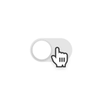
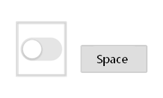
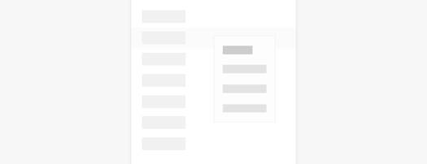

# 交互事件归一

本章节描述了在多种交互任务或场景下，应用在触屏上和其它常用的输入方式（例如鼠标、触摸板、键盘）上分别对应的正确的交互规则。**设计师和开发者应保证在当前输入方式下应用能够以正确的、符合用户习惯的交互规则进行响应。**

## 打开/切换对象

用户通过点击某个元素触发功能、访问新页面、或改变自身状态。

| **输入方式** | **交互行为** | **示意** |
| -------- | -------- | -------- |
| 触屏 | 单指单击 |  |
| 鼠标 | 左键单击&nbsp;/&nbsp;左键双击 |  |
| 触摸板 | 单指单击&nbsp;/&nbsp;单指双击 |  |
| 键盘 | 移动焦点到对象上后按下Space键 |  |

一般地，触屏手指的按下/抬起行为对应于光标的按下/抬起行为。

在一些特殊场景，可能会存在使用鼠标/触摸板双击打开对象的交互方案，例如打开桌面应用或文件。此类情况需由应用单独特殊处理，且同一功能不能同时支持单击和双击两种交互方式。

## 显示菜单

某个元素上显示弹出菜单或快捷方式菜单。

| **输入方式** | **交互行为** |
| -------- | -------- |
| 触屏 | 单指长按 |
| 鼠标 | 右键单击/左键长按（保留触屏习惯） |
| 触摸板 | 双指轻单击/重单击/单指重长按（保留触屏习惯） |
| 键盘 | （无通用操作） |

这里的菜单指的是广义的菜单，即用于展示用户可执行的操作的临时性弹出窗口。

凡是在触屏上通过长按显示的菜单，都需要支持鼠标右键单击和触摸板双指单击的触发方式。

## 拖拽对象

直接指向某个元素并移动到界面其他位置

  | **输入方式** | **交互行为** | 
| -------- | -------- |
| 触屏 | 长按某对象后触发可拖拽状态，然后移动手指改变对象位置。 | 
| 鼠标&nbsp;/&nbsp;触摸板 | 鼠标左键或触摸板单指按下即可拖拽对象（无需长按等待）。 | 
| 键盘 | （无通用操作） | 
