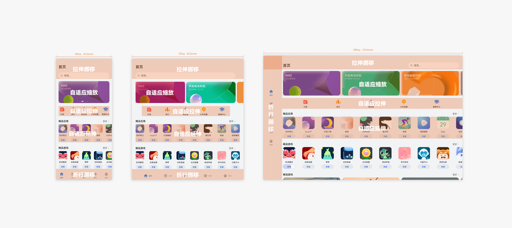
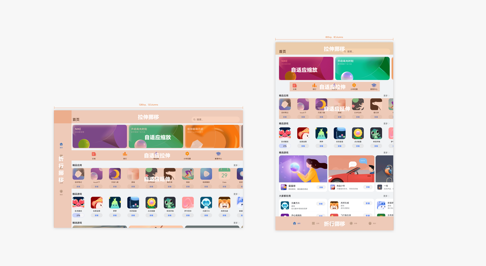
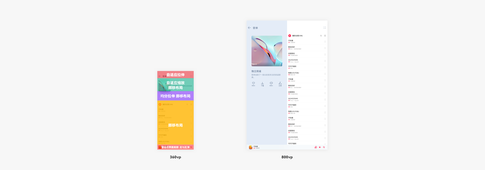
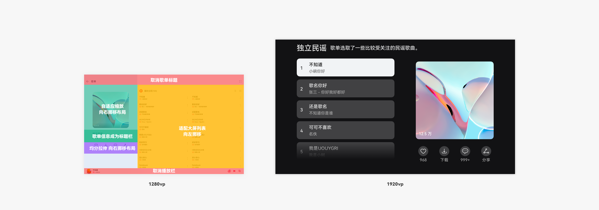

# 布局基础运用案例

## 平级导航的复合网格视图

平级导航的复合网格视图常出现在同时展示多种不同内容的界面。

例如，市场类应用作为典型的平级导航，其首页不同板块采用了不同布局能力。

- 标题栏与搜索栏：因元素单一、位置固定在顶部，因此适合采用自适应拉伸，并在大尺寸界面中从纵排变为横排，充分利用顶部区域。

- 运营横幅：在小设备上默认为多张轮播展示，随宽度变化采用自适应缩放，在中尺寸界面通过重复布局变为并排多张。

- 图标型网格：对于数量固定、且子内容重要程度相同的网格，需保证完全展示，可采用均分拉伸。对于数量不限的网格，则采用自适应延伸，在更大宽度上展示更多数量。

- 底部导航栏：导航类控件本身综合了均分和折行，在宽度变化时能占用均等宽度并在足够宽度下并排，当在大尺寸界面中，挪移到左边，使不同页签距离更近、同时符合视觉走向。

在横竖屏切换时，也保持了一致的布局能力，实际上完成了大尺寸和中尺寸的切换。

当界面出现在智慧屏上，虽然同是大尺寸界面，为了符合设备样式和遥控器交互规则，搜索栏转化为图标入口，导航栏挪移到页面上部。

## 层级导航的列表视图

层级导航的列表视图常出现在多类简单信息并列或多入口业务入口的界面。

例如，设置类应用作为典型的层级导航，其列表控件采用自适应拉伸。

在中尺寸设备中，为避免中间区域空白过大，采用缩进布局，大尺寸设备中，为充分利用横向空间，建议采用栅格系统形成分栏效果，并让列表元素在各自区域保持拉伸。

## 专辑详情页面

专辑详情不限于展示音乐内容，也用于展示视频、短视频、电台、书本等内容类合集。

例如，歌单类界面作为典型的内容垂类页面，其总体分为标题栏、歌单信息、歌单操作、歌单列表、播放栏几个板块。

- 标题栏：采用自适应拉伸。

- 歌单信息：采用自适应缩放，并在中尺寸界面进行缩进处理使内容呈现协调。

- 歌单操作：板块内部采用均分拉伸，在小尺寸设备上利用纵向空间、中尺寸设备上挪移到歌单封面右边。

- 歌单列表：板块内部采用左右拉伸，在中尺寸设备上可与歌单信息使用相同缩进布局。

- 播放栏：固定在界面底部，保持左右拉伸即可。

在横竖屏切换时，完成了中尺寸和大尺寸的切换。歌单列表板块进行挪移的同时，内部采用了重复布局。

歌单信息和歌单操作板块因较小宽高比，挪移到上下排布。

当界面出现在智慧屏上，为了符合沉浸简约的设备信息和遥控器交互规则，将部分歌单信息替代原来标题栏的位置，并取消播放栏。同时歌单列表居左，更方便遥控器选择。

