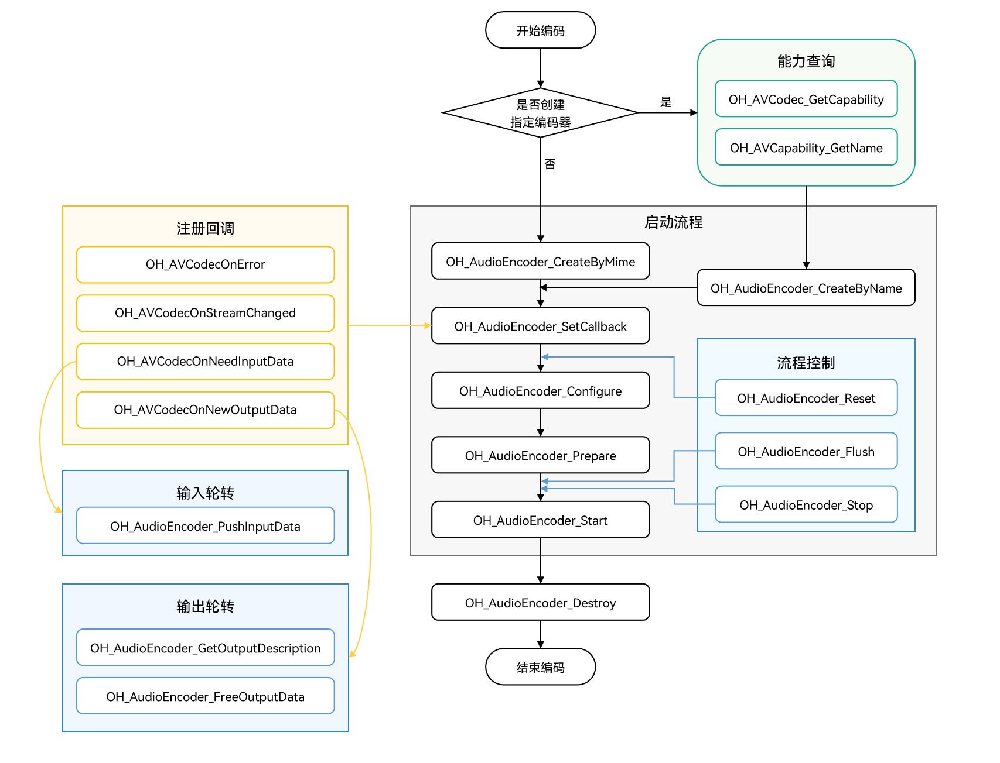

# 音频编码

开发者可以调用本模块的Native API接口，完成音频编码，即将音频PCM编码压缩成不同的格式。

接口不限制PCM数据的来源，开发者可以调用麦克风录制获取、也可以导入编辑后的PCM数据，通过音频编码，输出对应格式的码流，最后封装为目标格式文件。

当前支持的编码能力如下：

| 容器规格 | 音频编码类型 |
| -------- | :----------- |
| mp4      | AAC、Flac    |
| m4a      | AAC          |
| flac     | Flac         |
| aac      | AAC          |

**适用场景**

- 音频录制

  通过录制传入PCM，然后编码出对应格式的码流，最后封装成想要的格式
- 音频编辑

  编辑PCM后导出音频文件的场景，需要编码成对应音频格式后再封装成文件

## 开发步骤

详细的API说明请参考[API文档](../reference/native-apis/_audio_encoder.md)。

参考以下示例代码，完成音频编码的全流程，包括：创建编码器，设置编码参数（采样率/码率/声道数等），开始，刷新，重置，销毁资源。


在应用开发过程中，开发者应按一定顺序调用方法，执行对应操作，否则系统可能会抛出异常或生成其他未定义的行为。具体顺序可参考下列开发步骤及对应说明。
完整代码请参考[示例程序](https://gitee.com/openharmony/multimedia_av_codec/blob/master/test/nativedemo/audio_demo/avcodec_audio_aac_encoder_demo.cpp)。

如下为音频编码调用关系图：


1. 创建编码器实例对象

   应用可以通过名称或媒体类型创建编码器。

    ```cpp
    //通过 codecname 创建编码器
    OH_AVCapability *capability = OH_AVCodec_GetCapability(OH_AVCODEC_MIMETYPE_AUDIO_AAC, true);
    const char *name = OH_AVCapability_GetName(capability);
    OH_AVCodec *audioEnc = OH_AudioEncoder_CreateByName(name);
    ```

    ```cpp
    //通过媒体类型创建编码器
    OH_AVCodec *audioEnc = OH_AudioEncoder_CreateByMime(OH_AVCODEC_MIMETYPE_AUDIO_AAC); 
    ```

    ```cpp
    // 初始化队列
    class AEncSignal {
    public:
        std::mutex inMutex_;
        std::mutex outMutex_;
        std::mutex startMutex_;
        std::condition_variable inCond_;
        std::condition_variable outCond_;
        std::condition_variable startCond_;
        std::queue<uint32_t> inQueue_;
        std::queue<uint32_t> outQueue_;
        std::queue<OH_AVMemory *> inBufferQueue_;
        std::queue<OH_AVMemory *> outBufferQueue_;
        std::queue<OH_AVCodecBufferAttr> attrQueue_;
    };
    AEncSignal *signal_ = new AEncSignal();
    ```

2. 调用OH_AudioEncoder_SetCallback()设置回调函数。

   注册回调函数指针集合OH_AVCodecAsyncCallback，包括：

   - OH_AVCodecOnError：编码器运行错误。
   - OH_AVCodecOnStreamChanged：码流信息变化，如声道变化等。
   - OH_AVCodecOnNeedInputData：运行过程中需要新的输入数据，即编码器已准备好，可以输入PCM数据。
   - OH_AVCodecOnNewOutputData：运行过程中产生了新的输出数据，即编码完成。

   开发者可以通过处理该回调报告的信息，确保编码器正常运转。

    ```cpp
    // OH_AVCodecOnError回调函数的实现
    static void OnError(OH_AVCodec *codec, int32_t errorCode, void *userData)
    {
        (void)codec;
        (void)errorCode;
        (void)userData;
    }
    // OH_AVCodecOnStreamChanged回调函数的实现
    static void OnStreamChanged(OH_AVCodec *codec, OH_AVFormat *format, void *userData)
    {
        (void)codec;
        (void)format;
        (void)userData;
    }
    // OH_AVCodecOnNeedInputData回调函数的实现
    static void OnNeedInputData(OH_AVCodec *codec, uint32_t index, OH_AVMemory *data, void *userData)
    {
        (void)codec;
        // 编码输入码流送入InputBuffer队列
        AEncSignal *signal = static_cast<AEncSignal *>(userData);
        unique_lock<mutex> lock(signal->inMutex_);
        signal->inQueue_.push(index);
        signal->inBufferQueue_.push(data);
        signal->inCond_.notify_all();
    }
    // OH_AVCodecOnNewOutputData回调函数的实现
    static void OnNeedOutputData(OH_AVCodec *codec, uint32_t index, OH_AVMemory *data, OH_AVCodecBufferAttr *attr,
                                            void *userData)
    {
        (void)codec;
        // 将对应输出buffer的index送入OutputQueue_队列
        // 将对应编码完成的数据data送入outBuffer队列
        AEncSignal *signal = static_cast<AEncSignal *>(userData);
        unique_lock<mutex> lock(signal->outMutex_);
        signal->outQueue_.push(index);
        signal->outBufferQueue_.push(data);
        if (attr) {
            signal->attrQueue_.push(*attr);
        }
    }
    OH_AVCodecAsyncCallback cb = {&OnError, &OnStreamChanged, &OnNeedInputData, &OnNeedOutputData};
    // 配置异步回调
    int32_t ret = OH_AudioEncoder_SetCallback(audioEnc, cb, userData);
    ```

3. 调用OH_AudioEncoder_Configure设置编码器
   设置必选项：采样率，码率，以及声道数，声道类型、位深；可选项：最大输入长度
   flac编码： 需要额外标识兼容性级别(Compliance Level)和采样精度

    ```cpp
    enum AudioFormatType : int32_t {
        TYPE_AAC = 0,
        TYPE_FLAC = 1,
    };
    int32_t ret;
    // 配置音频采样率（必须）
    constexpr uint32_t DEFAULT_SMAPLERATE = 44100; 
    // 配置音频码率（必须）
    constexpr uint32_t DEFAULT_BITRATE = 32000;
    // 配置音频声道数（必须）
    constexpr uint32_t DEFAULT_CHANNEL_COUNT = 2;
    // 配置音频声道类型（必须）
    constexpr AudioChannelLayout CHANNEL_LAYOUT =AudioChannelLayout::STEREO;
    // 配置音频位深（必须） flac 只有SAMPLE_S16LE和SAMPLE_S32LE
    constexpr OH_BitsPerSample SAMPLE_FORMAT =OH_BitsPerSample::SAMPLE_S32LE;
    // 配置音频位深（必须）aac只有SAMPLE_S32P
    constexpr OH_BitsPerSample SAMPLE_AAC_FORMAT =OH_BitsPerSample::SAMPLE_S32P;
    // 配置音频compliance level (默认值0，取值范围-2~2)
    constexpr int32_t COMPLIANCE_LEVEL = 0;
    // 配置音频精度（必须） SAMPLE_S16LE和SAMPLE_S24LE和SAMPLE_S32LE
    constexpr BITS_PER_CODED_SAMPLE BITS_PER_CODED_SAMPLE =OH_BitsPerSample::SAMPLE_S24LE;
    // 配置最大输入长度（可选）
    constexpr uint32_t DEFAULT_MAX_INPUT_SIZE = 1024*DEFAULT_CHANNEL_COUNT *sizeof(float);//aac
    OH_AVFormat *format = OH_AVFormat_Create();
    // 写入format
    OH_AVFormat_SetIntValue(format,MediaDescriptionKey::MD_KEY_SAMPLE_RATE.data(),DEFAULT_SMAPLERATE);
    OH_AVFormat_SetIntValue(format,MediaDescriptionKey::MD_KEY_BITRATE.data(), DEFAULT_BITRATE);
    OH_AVFormat_SetIntValue(format,MediaDescriptionKey::MD_KEY_CHANNEL_COUNT.data(),DEFAULT_CHANNEL_COUNT);
    OH_AVFormat_SetIntValue(format,MediaDescriptionKey::MD_KEY_MAX_INPUT_SIZE.data(),DEFAULT_MAX_INPUT_SIZE);
    OH_AVFormat_SetLongValue(format,MediaDescriptionKey::MD_KEY_CHANNEL_LAYOUT.data(),CHANNEL_LAYOUT);
    OH_AVFormat_SetIntValue(format,MediaDescriptionKey::MD_KEY_AUDIO_SAMPLE_FORMAT.data(),SAMPLE_FORMAT);
    if(audioType == TYPE_AAC){
        OH_AVFormat_SetIntValue(format, MediaDescriptionKey::MD_KEY_AUDIO_SAMPLE_FORMAT.data(), SAMPLE_AAC_FORMAT);
    }
    if (audioType == TYPE_FLAC) {
        OH_AVFormat_SetIntValue(format, MediaDescriptionKey::MD_KEY_BITS_PER_CODED_SAMPLE.data(), BITS_PER_CODED_SAMPLE);
        OH_AVFormat_SetLongValue(format, MediaDescriptionKey::MD_KEY_COMPLIANCE_LEVEL.data(), COMPLIANCE_LEVEL);
    }
    // 配置编码器
    ret = OH_AudioEncoder_Configure(audioEnc, format);
    if (ret != AV_ERR_OK) {
        // 异常处理
    }
    ```

4. 调用OH_AudioEncoder_Prepare()，编码器就绪。

    ```c++
    OH_AudioEncoder_Prepare(audioEnc);
    ```

5. 调用OH_AudioEncoder_Start()启动编码器，进入运行态。

    ```c++
    inputFile_ = std::make_unique<std::ifstream>();
    // 打开待编码二进制文件路径
    inputFile_->open(inputFilePath.data(), std::ios::in |std::ios::binary); 
    //配置编码文件输出路径
    outFile_ = std::make_unique<std::ofstream>();
    outFile_->open(outputFilePath.data(), std::ios::out |std::ios::binary);
    // 开始编码
    ret = OH_AudioEncoder_Start(audioEnc);
    if (ret != AV_ERR_OK) {
        // 异常处理
    }
    ```

6. 调用OH_AudioEncoder_PushInputData()，写入待编码器的数据。
   如果是结束，需要对flag标识成AVCODEC_BUFFER_FLAGS_EOS
   
   aac： 样点数(FRAME_SIZE)固定为1024
   
   flac： 样点数(FRAME_SIZE)比较特殊需要，根据如下表格进行设置
   
   | 采样率 | 样点数 |
   | :----: | :----: |
   |  8000  |  576   |
   | 16000  |  1152  |
   | 22050  |  2304  |
   | 24000  |  2304  |
   | 32000  |  2304  |
   | 44100  |  4608  |
   | 48000  |  4608  |
   | 88200  |  8192  |
   | 96000  |  8192  |
   
   **注意**：aac的样点数固定为1024，其他值会直接返回错误码，flac的样点数建议根据采样率按照表格传入，大于这个值也会返回错误码，如果小于有可能出现编码文件损坏问题。

    ```c++
    constexpr int32_t FRAME_SIZE = 1024; //aac
    constexpr int32_t DEFAULT_CHANNEL_COUNT =2;
    constexpr int32_t INPUT_FRAME_BYTES = DEFAULT_CHANNEL_COUNT * FRAME_SIZE * sizeof(float); //aac
    // 配置buffer info信息
    OH_AVCodecBufferAttr info;
    // 设置输入pkt尺寸、偏移量、时间戳等信息
    info.size = pkt_->size;
    info.offset = 0;
    info.pts = pkt_->pts;
    info.flags = AVCODEC_BUFFER_FLAGS_CODEC_DATA;
    auto buffer = signal_->inBufferQueue_.front();
    if (inputFile_->eof()){
        info.size = 0;
        info.flags = AVCODEC_BUFFER_FLAGS_EOS;
    }else{
        inputFile_->read((char *)OH_AVMemory_GetAddr(buffer), INPUT_FRAME_BYTES);
    }
    uint32_t index = signal_->inQueue_.front();
    // 送入编码输入队列进行编码, index为对应队列下标
    int32_t ret = OH_AudioEncoder_PushInputData(audioEnc, index,info);
    if (ret != AV_ERR_OK) {
        // 异常处理
    }
    ```

7. 调用OH_AudioEncoder_FreeOutputData()，输出编码格式码流

    ```c++
    OH_AVCodecBufferAttr attr = signal_->attrQueue_.front();
    OH_AVMemory *data = signal_->outBufferQueue_.front();
    uint32_t index = signal_->outQueue_.front();
    // 将编码完成数据data写入到对应输出文件中
    outFile_->write(reinterpret_cast<char *>(OH_AVMemory_GetAdd(data)), attr.size);
    // 释放已完成写入的数据
    ret = OH_AudioEncoder_FreeOutputData(audioEnc, index);
    if (ret != AV_ERR_OK) {
        // 异常处理
    }
    if (attr.flags == AVCODEC_BUFFER_FLAGS_EOS) {
        cout << "decode eos" << endl;
        isRunning_.store(false);
        break;
    }
    ```

8. （可选）调用OH_AudioEncoder_Flush()刷新编码器。
   调用OH_AudioEncoder_Flush()后，编码器处于Flush状态，会将当前编码队列清空。
   此时需要调用OH_AudioEncoder_Start()重新开始编码。
   使用情况：
   * 在文件EOS之后，需要调用刷新
   * 在执行过程中遇到可继续执行的错误时（即OH_AudioEncoder_IsValid 为true）可以调用，然后重新调用OH_AudioEncoder_Start

    ```c++
    // 刷新编码器 audioEnc
    ret = OH_AudioEncoder_Flush(audioEnc);
    if (ret != AV_ERR_OK) {
        // 异常处理
    }
    // 重新开始编码
    ret = OH_AudioEncoder_Start(audioEnc);
    if (ret != AV_ERR_OK) {
        // 异常处理
    }
    ```

9. （可选）调用OH_AudioEncoder_Reset()重置编码器。
   调用OH_AudioEncoder_Reset()后，编码器回到初始化的状态，需要调用OH_AudioEncoder_Configure()重新配置，然后调用OH_AudioEncoder_Start()重新开始编码。。

   ```c++
   // 重置编码器 audioEnc
   ret = OH_AudioEncoder_Reset(audioEnc);
   if (ret != AV_ERR_OK) {
       // 异常处理
   }
   // 重新配置编码器参数
   ret = OH_AudioEncoder_Configure(audioEnc, format);
   if (ret != AV_ERR_OK) {
       // 异常处理
   }
   ```
10. 调用OH_AudioEncoder_Stop()停止编码器。

    ```c++
    // 终止编码器 audioEnc
    ret = OH_AudioEncoder_Stop(audioEnc);
    if (ret != AV_ERR_OK) {
        // 异常处理
    }
        return ret;
    ```
11. 调用OH_AudioEncoder_Destroy()销毁编码器实例，释放资源。
    **注意**：资源不能重复销毁

    ```c++
    // 调用OH_AudioEncoder_Destroy, 注销编码器
    ret = OH_AudioEncoder_Destroy(audioEnc);
    if (ret != AV_ERR_OK) {
        // 异常处理
    } else {
        audioEnc = NULL; //不可重复destroy
    }
    return ret;
    ```
