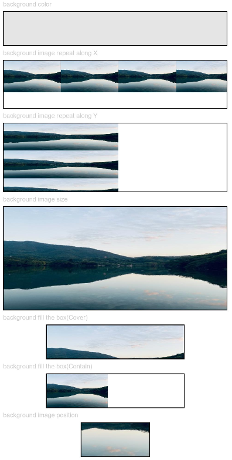

# 背景设置

设置组件的背景样式。

>  **说明：**
>
>  从API Version 7开始支持。后续版本如有新增内容，则采用上角标单独标记该内容的起始版本。

## 属性

| 名称 | 参数类型 | 描述 |
| -------- | -------- | -------- |
| background<sup>10+</sup> | builder: [CustomBuilder](ts-types.md#custombuilder8),<br>options?: {align?:[Alignment](ts-appendix-enums.md#alignment)} | builder：自定义背景。<br/>align：设置自定义背景与组件的对齐方式。<br/>同时设置了background，backgroundColor，backgroundImage时，叠加显示，background在最上层。 |
| backgroundColor | [ResourceColor](ts-types.md#resourcecolor) | 设置组件的背景色。<br/>从API version 9开始，该接口支持在ArkTS卡片中使用。 |
| backgroundImage | src:&nbsp;[ResourceStr](ts-types.md#resourcestr),<br/>repeat?:&nbsp;[ImageRepeat](ts-appendix-enums.md#imagerepeat) | src：图片地址，支持网络图片资源地址和本地图片资源地址和Base64，不支持svg类型的图片。<br/>repeat：设置背景图片的重复样式，默认不重复。当设置的背景图片为透明底色图片，且同时设置了backgroundColor时，二者叠加显示，背景颜色在最底部。<br/>从API version 9开始，该接口支持在ArkTS卡片中使用。 |
| backgroundImageSize | {<br/>width?:&nbsp;[Length](ts-types.md#length),<br/>height?:&nbsp;[Length](ts-types.md#length)<br/>}&nbsp;\|&nbsp;[ImageSize](ts-appendix-enums.md#imagesize) | 设置背景图像的高度和宽度。当输入为{width:&nbsp;Length,&nbsp;height:&nbsp;Length}对象时，如果只设置一个属性，则第二个属性保持图片原始宽高比进行调整。默认保持原图的比例不变。<br/>width和height取值范围： [0, +∞)<br/>默认值：ImageSize.Auto<br/>从API version 9开始，该接口支持在ArkTS卡片中使用。<br/>**说明：** <br/>设置为小于0的值时，按值为0显示。当设置了height未设置width时，width根据图片原始宽高比进行调整。 |
| backgroundImagePosition | [Position](ts-types.md#position8)&nbsp;\|&nbsp;[Alignment](ts-appendix-enums.md#alignment) | 设置背景图在组件中显示位置，即相对于组件左上角的坐标。<br/>默认值：<br/>{<br/>x:&nbsp;0,<br/>y:&nbsp;0<br/>} <br/> x和y值设置百分比时，偏移量是相对组件自身宽高计算的。<br/>从API version 9开始，该接口支持在ArkTS卡片中使用。 |
| backgroundBlurStyle<sup>9+</sup> | value:[BlurStyle](ts-appendix-enums.md#blurstyle9),<br/>options<sup>10+</sup>?:[BackgroundBlurStyleOptions](#backgroundblurstyleoptions10对象说明) | 为当前组件提供一种在背景和内容之间的模糊能力。<br/>value: 背景模糊样式。模糊样式中封装了模糊半径、蒙版颜色、蒙版透明度、饱和度、亮度五个参数。<br/>options: 可选参数，背景模糊选项。<br/>该接口支持在ArkTS卡片中使用。 |

## BackgroundBlurStyleOptions<sup>10+</sup>对象说明

| 名称                        | 参数类型                                                | 必填 | 描述                                                         |
| --------------------------- | ------------------------------------------------------- | ---- | ------------------------------------------------------------ |
| colorMode<sup>10+</sup>     | [ThemeColorMode](ts-appendix-enums.md#themecolormode10) | 否   | 背景模糊效果使用的深浅色模式。<br/>默认值：ThemeColorMode.System |
| adaptiveColor<sup>10+</sup> | [AdaptiveColor](ts-appendix-enums.md#adaptivecolor10)   | 否   | 背景模糊效果使用的取色模式。<br/>默认值：AdaptiveColor.Default |
| scale<sup>10+</sup> | number   | 否   | 背景材质模糊效果程度。此参数为系统接口。<br/>默认值：1.0 <br/>取值范围：[0.0, 1.0]<br/>|

## 示例

### 示例1

```ts
// xxx.ets
@Entry
@Component
struct BackgroundExample {

  build() {
    Column({ space: 5 }) {
      Text('background color').fontSize(9).width('90%').fontColor(0xCCCCCC)
      Row().width('90%').height(50).backgroundColor(0xE5E5E5).border({ width: 1 })

      Text('background image repeat along X').fontSize(9).width('90%').fontColor(0xCCCCCC)
      Row()
        .backgroundImage('/comment/bg.jpg', ImageRepeat.X)
        .backgroundImageSize({ width: '250px', height: '140px' })
        .width('90%')
        .height(70)
        .border({ width: 1 })

      Text('background image repeat along Y').fontSize(9).width('90%').fontColor(0xCCCCCC)
      Row()
        .backgroundImage('/comment/bg.jpg', ImageRepeat.Y)
        .backgroundImageSize({ width: '500px', height: '120px' })
        .width('90%')
        .height(100)
        .border({ width: 1 })

      Text('background image size').fontSize(9).width('90%').fontColor(0xCCCCCC)
      Row()
        .width('90%').height(150)
        .backgroundImage('/comment/bg.jpg', ImageRepeat.NoRepeat)
        .backgroundImageSize({ width: 1000, height: 500 })
        .border({ width: 1 })

      Text('background fill the box(Cover)').fontSize(9).width('90%').fontColor(0xCCCCCC)
      // 不保准图片完整的情况下占满盒子
      Row()
        .width(200)
        .height(50)
        .backgroundImage('/comment/bg.jpg', ImageRepeat.NoRepeat)
        .backgroundImageSize(ImageSize.Cover)
        .border({ width: 1 })

      Text('background fill the box(Contain)').fontSize(9).width('90%').fontColor(0xCCCCCC)
      // 保准图片完整的情况下放到最大
      Row()
        .width(200)
        .height(50)
        .backgroundImage('/comment/bg.jpg', ImageRepeat.NoRepeat)
        .backgroundImageSize(ImageSize.Contain)
        .border({ width: 1 })

      Text('background image position').fontSize(9).width('90%').fontColor(0xCCCCCC)
      Row()
        .width(100)
        .height(50)
        .backgroundImage('/comment/bg.jpg', ImageRepeat.NoRepeat)
        .backgroundImageSize({ width: 1000, height: 560 })
        .backgroundImagePosition({ x: -500, y: -300 })
        .border({ width: 1 })
    }
    .width('100%').height('100%').padding({ top: 5 })
  }
}
```



### 示例2

```ts
// xxx.ets
@Entry
@Component
struct BackgroundBlurStyleDemo {
  build() {
    Column() {
      Row() {
        Text("Thin Material")
      }
      .width('50%')
      .height('50%')
      .backgroundBlurStyle(BlurStyle.Thin, { colorMode: ThemeColorMode.LIGHT, adaptiveColor: AdaptiveColor.DEFAULT, scale: 1.0 })
      .position({ x: '15%', y: '30%' })
    }
    .height('100%')
    .width('100%')
    .backgroundImage($r('app.media.bg'))
    .backgroundImageSize(ImageSize.Cover)
  }
}
```


### 示例3

```ts
// xxx.ets
@Entry
@Component
struct BackgroundExample {
  @Builder renderBackground() {
    Column() {
      Progress({value : 50})
    }
  }

  build() {
    Column() {
      Text("content")
        .width(100)
        .height(40)
        .fontColor("#FFF")
        .position({x:50, y:80})
        .textAlign(TextAlign.Center)
        .backgroundColor(Color.Green)
    }
    .width(200).height(200)
    .background(this.renderBackground)
    .backgroundColor(Color.Gray)
  }
}
```

