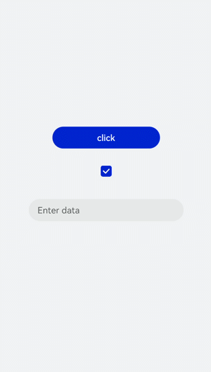
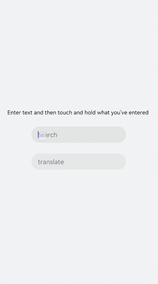
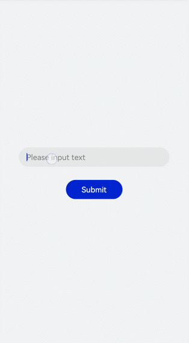
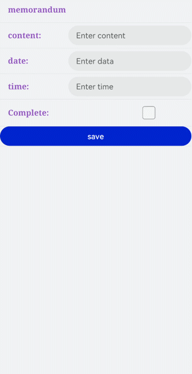

# input开发指导

input是交互式组件，用于接收用户数据。其类型可设置为日期、多选框和按钮等。具体用法请参考[input API](../reference/arkui-js/js-components-basic-input.md)。


## 创建input组件

在pages/index目录下的hml文件中创建一个input组件。

```html
<!-- xxx.hml -->
<div class="container">       
  <input type="text">             
     Please enter the content  
  </input>
</div>
```

```css
/* xxx.css */
.container {
  width: 100%;
  height: 100%;
  flex-direction: column;
  justify-content: center;
  align-items: center;
  background-color: #F1F3F5;
}
```


## 设置input类型

通过设置type属性来定义input类型，如将input设置为button、date等。

```html
<!-- xxx.hml -->
<div class="container">
  <div class="div-button">
    <dialog class="dialogClass" id="dialogId">
      <div class="content">
        <text>this is a dialog</text>
      </div>
    </dialog>
    <input class="button" type="button" value="click" onclick="btnclick"></input>
  </div>
  <div class="content">
    <input onchange="checkboxOnChange" checked="true" type="checkbox"></input>
  </div>
  <div class="content">
    <input type="date" class="flex" placeholder="Enter data"></input>
  </div>
</div>
```

```css
/* xxx.css */
.container {
  width: 100%;
  height: 100%;
  align-items: center;
  flex-direction: column;
  justify-content: center;
  background-color: #F1F3F5 ;
}
.div-button {
  flex-direction: column;
  align-items: center;
}
.dialogClass{
  width:80%;
  height: 200px;
}
.button {
  margin-top: 30px;
  width: 50%;
}
.content{
  width: 90%;
  height: 150px;
  align-items: center;
  justify-content: center;
}
.flex {
  width: 80%;
  margin-bottom:40px;
}
```

```js
// xxx.js
export default {
  btnclick(){
    this.$element('dialogId').show()
  },
}
```





> **说明：**
>
> 仅当input类型为checkbox和radio时，当前组件是否选中的属性checked才生效，默认值为false。


## 事件绑定

向input组件添加search和translate事件。
```html
<!-- xxx.hml -->
<div class="content">
  <text style="margin-left: -7px;">
    <span>Enter text and then touch and hold what you've entered</span>
  </text>
  <input class="input" type="text" onsearch="search" placeholder="search"> </input>
  <input class="input" type="text" ontranslate="translate" placeholder="translate"> </input>
</div>
```

```css
/* xxx.css */
.content {
  width: 100%;
  height: 100%;
  flex-direction: column;
  align-items: center;
  justify-content: center;
  background-color: #F1F3F5;
}
.input {
  margin-top: 50px;
  width: 60%;
  placeholder-color: gray;
}
text{
  width:100%;
  font-size:25px;
  text-align:center;
}
```

```js
// xxx.js
import promptAction from '@ohos.promptAction'
export default {
  search(e){
    promptAction.showToast({
      message:  e.value,
      duration: 3000,
    });
  },
  translate(e){
    promptAction.showToast({
      message:  e.value,
      duration: 3000,
    });
  }
}
```




## 设置输入提示

通过对input组件添加showError方法来提示输入的错误原因。

```html
<!-- xxx.hml -->
<div class="content">
  <input id="input" class="input" type="text"  maxlength="20" placeholder="Please input text" onchange="change">
  </input>
  <input class="button" type="button" value="Submit" onclick="buttonClick"></input>
</div>
```

```css
/* xxx.css */
.content {
  width: 100%;
  height: 100%;
  flex-direction: column;
  align-items: center;
  justify-content: center;
  background-color: #F1F3F5;
}
.input {
  width: 80%;
  placeholder-color: gray;
}
.button {
  width: 30%;
  margin-top: 50px;
}
```

```js
// xxx.js
import promptAction from '@ohos.promptAction' 
 export default { 
   data:{ 
     value:'', 
   }, 
   change(e){ 
     this.value = e.value; 
     promptAction.showToast({ 
     message: "value: " + this.value, 
       duration: 3000, 
      }); 
   }, 
   buttonClick(e){ 
     if(this.value.length > 6){ 
       this.$element("input").showError({        
         error:  'Up to 6 characters are allowed.'       
       }); 
      }else if(this.value.length == 0){ 
        this.$element("input").showError({         
          error:this.value + 'This field cannot be left empty.'       
        }); 
      }else{ 
        promptAction.showToast({ 
          message: "success " 
        }); 
      } 
   }, 
 }
```



> **说明：**
> 该方法在input类型为text、email、date、time、number和password时生效。


## 场景示例


根据场景选择不同类型的input输入框，完成信息录入。


```html
<!-- xxx.hml -->
<div class="container">    
  <div class="label-item"> 
    <label>memorandum</label>   
  </div>    
  <div class="label-item">        
    <label class="lab" target="input1">content:</label>        
    <input class="flex" id="input1" placeholder="Enter content" />    
  </div>    
  <div class="label-item">        
    <label class="lab" target="input3">date:</label>        
    <input class="flex" id="input3" type="date" placeholder="Enter data" />    
  </div>    
  <div class="label-item">        
    <label class="lab" target="input4">time:</label>        
    <input class="flex" id="input4" type="time" placeholder="Enter time" />    
  </div>   
  <div class="label-item">        
    <label class="lab" target="checkbox1">Complete:</label>        
    <input class="flex" type="checkbox" id="checkbox1" style="width: 100px;height: 100px;" />    
  </div>    
  <div class="label-item">        
    <input class="flex" type="button" id="button" value="save" onclick="btnclick"/>    
  </div>
</div>
```


```css
/* xxx.css */
.container { 
  flex-direction: column;
  background-color: #F1F3F5;
}
.label-item {   
  align-items: center;
  border-bottom-width: 1px;border-color: #dddddd;
}
.lab {    
  width: 400px;}
label {    
  padding: 30px;
  font-size: 30px;      
  width: 320px;
  font-family: serif;
  color: #9370d8;
  font-weight: bold;
}
.flex {    
  flex: 1;
}
.textareaPadding {    
  padding-left: 100px;
}
```


```js
// xxx.js
import promptAction from '@ohos.promptAction';
export default {    
  data: {    
  },    
  onInit() { 
  },   
  btnclick(e) {        
    promptAction.showToast({            
      message:'Saved successfully!'        
    })    
  }
}     
```



