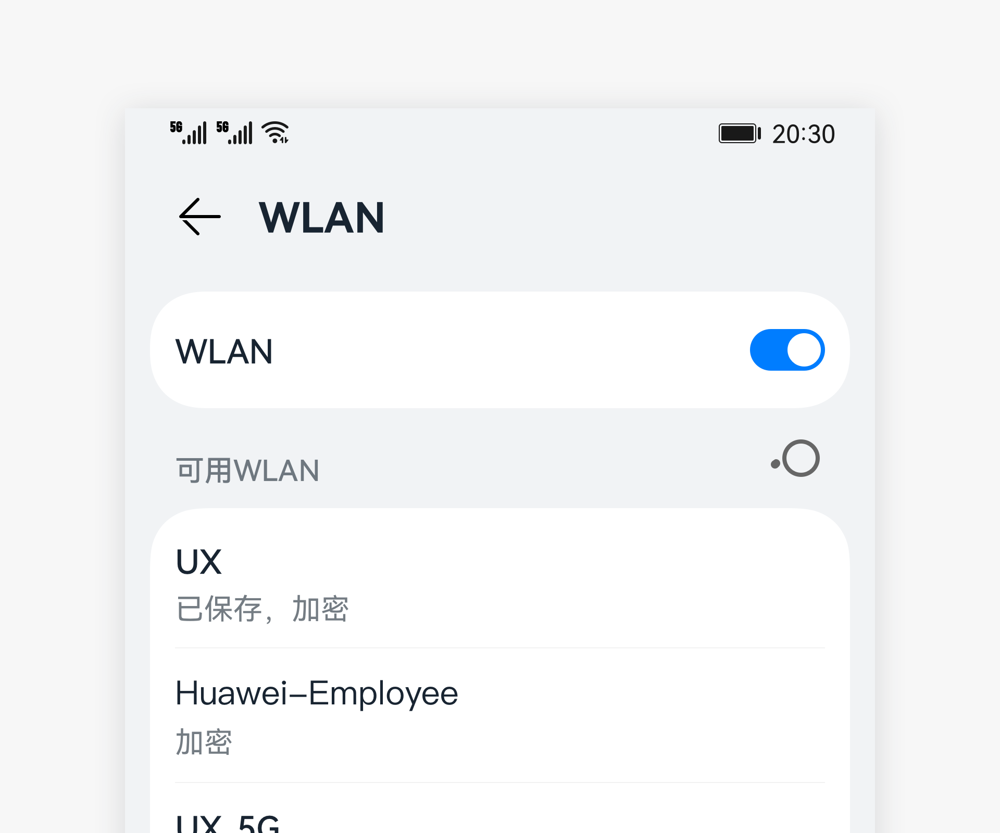

# 标题栏

标题栏是用于呈现当前界面的名称和操作入口的控件。

## 如何使用

- 标题栏主要用于工具界面或内容型界面。

- 标题栏应当放在界面顶部。当需要更突出功能或内容时，可以不需要突出标题。

### 普通标题栏

- 当标题栏用于不需要突出标题的场景时使用

- 标题栏的右侧可以放置常用操作的图标，帮助用户通过点击执行对应的操作。

- 除了沉浸式界面，所有常规设计界面都需要提供标题栏。
  

### 非一级界面标题栏

- 非一级界面的标题是界面的名称。非一级界面标题的左侧需要显示“返回”图标，用于指示用户可以回到上一个视图或层级。

- 为了帮助用户返回上一级，文本标题左侧需要提供一个返回按钮。

- 双行标题中的第二行标题，用于对第一行标题进行辅助说明。

- 【不推荐】当需要有多个视图可以切换，但除默认视图外其他视图极少使用时，可以使用下拉菜单型标题。这种做法会导致下拉菜单型标题里面的内容被隐藏，降低用户的使用，因此不推荐使用。
  

## 界面写作规则

- 标题简洁明了。

- 标题和进入该页面的上一级界面的功能选项名称保持一致。

- 无标点，以名词短语为主。

## 资源

标题栏相关的开发文档详见基础组件[“Navigation”](https://gitee.com/openharmony/docs/blob/master/zh-cn/application-dev/reference/arkui-ts/ts-basic-components-navigation.md)。
