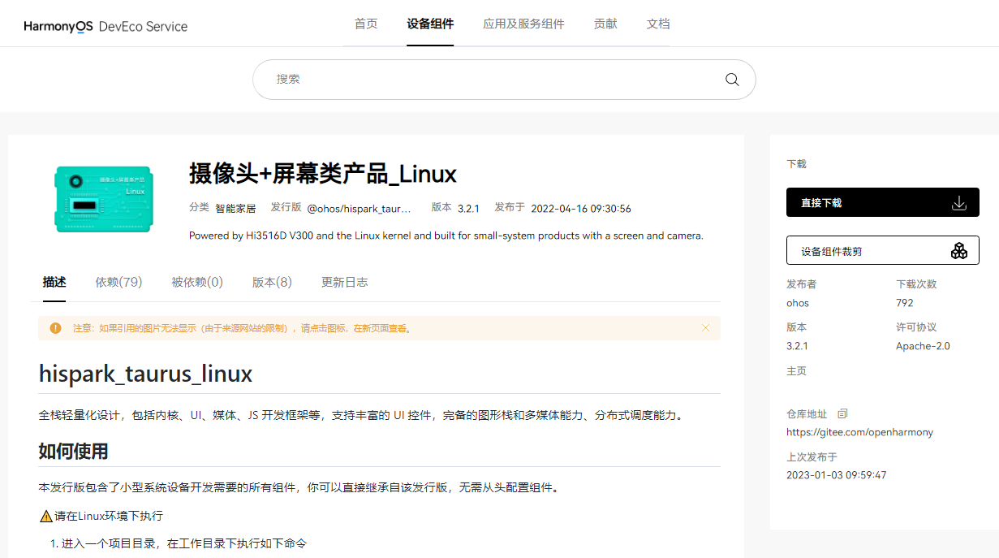

# 获取源码


## OpenHarmony介绍

OpenHarmony是由开放原子开源基金会（OpenAtom Foundation）孵化及运营的开源项目，目标是面向全场景、全连接、全智能时代，搭建一个智能终端设备操作系统的框架和平台，促进万物互联产业的繁荣发展。


开源代码仓库地址：[https://openharmony.gitee.com](https://openharmony.gitee.com)。


## 获取源码概述

本文档将介绍如何获取OpenHarmony源码并说明OpenHarmony的源码目录结构。OpenHarmony的代码以[组件](../hpm-part/hpm-part-about.md)的形式开放，开发者可以通过如下其中一种方式获取：

- **获取方式1**：从码云代码仓库获取。通过repo或git工具从代码仓库中下载，此方式可获取最新代码。

- **获取方式2**：通过[DevEco Marketplace](https://repo.harmonyos.com/#/cn/home)网站获取。访问[DevEco Marketplace](https://repo.harmonyos.com/#/cn/home)网站，查找满足需求的开源发行版，直接下载（或者定制后下载），再通过hpm-cli命令工具将所需的组件及工具链下载、安装到本地。

- **获取方式3**：从镜像站点下载归档后的发行版压缩文件。如果要获取旧版本的源码，也可通过此方式获取，此方式下载速度较快。

- **获取方式4**：从github代码仓库获取。通过repo或git工具从代码仓库中下载，此方式可获取最新代码。


## 获取方式1：从码云仓库获取


### 适用场景

- 基于OpenHarmony的稳定分支建立自己的基线，分发下游客户。

- 已经完成自身软件与OpenHarmony的对接，需要进行OpenHarmony官方认证。

- 芯片/模组/app通过OpenHarmony官方认证后，贡献代码到OpenHarmony社区。

- 修复OpenHarmony的问题。

- 学习OpenHarmony的源码。


### 前提条件

1. 注册码云gitee帐号。

2. 注册码云SSH公钥，请参考[码云帮助中心](https://gitee.com/help/articles/4191)。

3. 安装[git客户端](https://git-scm.com/book/zh/v2/%E8%B5%B7%E6%AD%A5-%E5%AE%89%E8%A3%85-Git)和[git-lfs](https://gitee.com/vcs-all-in-one/git-lfs?_from=gitee_search#downloading)并配置用户信息。
  
   ```shell
   git config --global user.name "yourname"
   git config --global user.email "your-email-address"
   git config --global credential.helper store
   ```

4. 执行如下命令安装码云repo工具。

   下述命令中的安装路径以"~/bin"为例，请用户自行创建所需目录。
  
   ```shell
   mkdir ~/bin
   curl https://gitee.com/oschina/repo/raw/fork_flow/repo-py3 -o ~/bin/repo 
   chmod a+x ~/bin/repo
   pip3 install -i https://repo.huaweicloud.com/repository/pypi/simple requests
   ```

5. 将repo添加到环境变量。

   ```shell
   vim ~/.bashrc               # 编辑环境变量
   export PATH=~/bin:$PATH     # 在环境变量的最后添加一行repo路径信息
   source ~/.bashrc            # 应用环境变量
   ```


### 操作步骤


>  **说明：**<br>
>
> 发布版本代码相对比较稳定，开发者可基于发布版本代码进行商用功能开发。Master主干为开发分支，开发者可通过Master主干获取最新特性。

- **OpenHarmony发布版本代码获取**

  OpenHarmony发布版本获取源码方式请参考[Release Notes](../../release-notes/Readme.md)。

- **OpenHarmony主干代码获取**
  
  方式一（推荐）：通过repo + ssh下载（需注册公钥，请参考[码云帮助中心](https://gitee.com/help/articles/4191)）。
  
  ```shell
  repo init -u git@gitee.com:openharmony/manifest.git -b master --no-repo-verify
  repo sync -c
  repo forall -c 'git lfs pull'
  ```

  方式二：通过repo + https下载。

  
  ```shell
  repo init -u https://gitee.com/openharmony/manifest.git -b master --no-repo-verify
  repo sync -c
  repo forall -c 'git lfs pull'
  ```


## 获取方式2：从DevEco Marketplace获取


### 适用场景

对于刚接触OpenHarmony的新用户，希望能够参考一些示例解决方案从而进行快速开发。可以在[DevEco Marketplace](https://repo.harmonyos.com/#/cn/home)网站获取下载开源发行版，也可以在开源发行版的基础上定制（添加或删除组件）。然后通过包管理器命令行工具（hpm-cli）将需要的组件及相关的编译工具链全部下载、安装到本地。


### 前提条件

先要在本地安装Node.js和hpm命令行工具，安装步骤如下：

1. 安装Node.js。

   官网下载并在本地安装Node.js。

   [Node.js](https://nodejs.org/)版本需不低于12.x (包含npm 6.14.4)，推荐安装LTS版本。

2. 通过Node.js自带的npm安装hpm命令行工具。

   打开CMD，执行以下命令：
     
   ```shell
   npm install -g @ohos/hpm-cli
   ```

3. 安装完成后执行如下命令，显示hpm版本，即安装成功。
  
   ```shell
   hpm -V 或 hpm --version
   ```

4. 如果升级hpm的版本，请执行如下命令：
  
   ```shell
   npm update -g @ohos/hpm-cli
   ```


### 操作步骤

1. 查找发行版。
   1. 访问[DevEco Marketplace](https://repo.harmonyos.com/#/cn/home)，设定搜索的对象为设备组件，并在左侧边栏选择开源发行版，如下图所示。
   2. 在搜索框输入关键字搜索，如“摄像头”。
   3. 结果中显示与关键字匹配的发行版，可以进一步根据组件类别等过滤条件（如：OS版本，适配的开发板，内核）精确筛选。
   4. 查找合适的发行版，点击查看发行版的详情介绍。

         **图1** 包管理

         

2. 了解发行版详情。
   1. 仔细阅读发行版的说明信息，以了解使用场景、特性、组件构成、使用方法以及如何进行定制化，如下图所示。
   2. 点击「直接下载」，将发行版下载到本地。
   3. 点击「设备组件裁剪」，将对发行版包含的组件进行定制（添加/删除）。

         **图2** 发行版示例

         

3. 定制组件。
   1. 进入发行版的定制页面，如下图所示。
   2. 添加和删除组件。
      - 点击“可定制组件”后的添加按钮，在弹出的“添加组件”窗口中进行所需组件的添加。
      - 在“可定制组件”下拉列表中，点击待删除组件后方的删除按钮，将该组件删除。
   3. 在右边填写您的项目基本信息，包括名称、版本、描述等信息。
   4. 点击页面右下角的「下载」，系统会根据您的选择，生成相应的OpenHarmony代码结构文件（如my_cust_dist.zip），保存至本地文件。

         **图3** 组件定制

         

4. 安装组件。
   1. 解压下载的压缩文件，用命令行工具CMD（Linux下的Shell终端）。
   2. 在解压后的文件目录下执行hpm install指令，系统会自动下载并安装组件。安装窗口显示“Install successful”表示组件下载及安装成功。
   3. 下载的组件将保存在工程目录下的ohos_bundles文件夹中（部分组件安装后会将源码复制到指定目录下）。


## 获取方式3：从镜像站点获取

为了获得更好的下载性能，您可以选择从以下站点的镜像库获取源码或者对应的解决方案。

本部分只提供OpenHarmony LTS最新版本和最新发布版本的源码获取方式， 其他版本获取源码方式以及具体版本信息请参考[Release Notes](../../release-notes/Readme.md)。

  **表1** 获取源码路径

| **LTS版本源码** | **版本信息** | **下载站点** | **SHA256校验码** | **软件包容量** |
| -------- | -------- | -------- | -------- | -------- |
| 全量代码（标准、轻量和小型系统） | 3.0 | [站点](https://repo.huaweicloud.com/openharmony/os/3.0/code-v3.0-LTS.tar.gz) | [SHA256校验码](https://repo.huaweicloud.com/openharmony/os/3.0/code-v3.0-LTS.tar.gz.sha256) | 7.0 GB |
| 标准系统解决方案（二进制） | 3.0 | [站点](https://repo.huaweicloud.com/openharmony/os/3.0/standard.tar.gz) | [SHA256校验码](https://repo.huaweicloud.com/openharmony/os/3.0/standard.tar.gz.sha256) | 973.7 MB |
| Hi3861解决方案（二进制） | 3.0 | [站点](https://repo.huaweicloud.com/openharmony/os/3.0/hispark_pegasus.tar.gz) | [SHA256校验码](https://repo.huaweicloud.com/openharmony/os/3.0/hispark_pegasus.tar.gz.sha256) | 16.5 MB |
| Hi3518解决方案（二进制） | 3.0 | [站点](https://repo.huaweicloud.com/openharmony/os/3.0/hispark_aries.tar.gz) | [SHA256校验码](https://repo.huaweicloud.com/openharmony/os/3.0/hispark_aries.tar.gz.sha256) | 158.1 MB |
| Hi3516解决方案-LiteOS（二进制） | 3.0 | [站点](https://repo.huaweicloud.com/openharmony/os/3.0/hispark_taurus.tar.gz) | [SHA256校验码](https://repo.huaweicloud.com/openharmony/os/3.0/hispark_taurus.tar.gz.sha256) | 248.9 MB |
| Hi3516解决方案-Linux（二进制） | 3.0 | [站点](https://repo.huaweicloud.com/openharmony/os/3.0/hispark_taurus_linux.tar.gz) | [SHA256校验码](https://repo.huaweicloud.com/openharmony/os/3.0/hispark_taurus_linux.tar.gz.sha256) | 418.1 MB |
| RELEASE-NOTES | 3.0 | [站点](https://gitee.com/openharmony/docs/blob/OpenHarmony-3.0-LTS/zh-cn/release-notes/OpenHarmony-v3.0-LTS.md) | - | - |
| **最新发布版本源码** | **版本信息** | **下载站点** | **SHA256校验码** | **软件包容量** |
| 全量代码（标准、轻量和小型系统）        | 4.0 Beta1    | [站点](https://repo.huaweicloud.com/openharmony/os/4.0-Beta1/code-v4.0-Beta1.tar.gz) | [SHA256校验码](https://repo.huaweicloud.com/openharmony/os/4.0-Beta1/code-v4.0-Beta1.tar.gz.sha256) | 26.2 GB |
| Hi3861解决方案（二进制）        | 4.0 Beta1    | [站点](https://repo.huaweicloud.com/openharmony/os/4.0-Beta1/hispark_pegasus.tar.gz) | [SHA256校验码](https://repo.huaweicloud.com/openharmony/os/4.0-Beta1/hispark_pegasus.tar.gz.sha256) | 25.1 MB |
| Hi3516解决方案-LiteOS（二进制） | 4.0 Beta1    | [站点](https://repo.huaweicloud.com/openharmony/os/4.0-Beta1/hispark_taurus_LiteOS.tar.gz) | [SHA256校验码](https://repo.huaweicloud.com/openharmony/os/4.0-Beta1/hispark_taurus_LiteOS.tar.gz.sha256) | 287.6 MB |
| Hi3516解决方案-Linux（二进制）  | 4.0 Beta1    | [站点](https://repo.huaweicloud.com/openharmony/os/4.0-Beta1/hispark_taurus_Linux.tar.gz) | [SHA256校验码](https://repo.huaweicloud.com/openharmony/os/4.0-Beta1/hispark_taurus_Linux.tar.gz.sha256) | 186.4 MB |
| RK3568标准系统解决方案（二进制）        | 4.0 Beta1    | [站点](https://repo.huaweicloud.com/openharmony/os/4.0-Beta1/dayu200_standard_arm32.tar.gz) | [SHA256校验码](https://repo.huaweicloud.com/openharmony/os/4.0-Beta1/dayu200_standard_arm32.tar.gz.sha256) | 4.5 GB |
| RELEASE-NOTES | 4.0 Beta1 | [站点](../../release-notes/OpenHarmony-v4.0-beta1.md) | - | - |
| **编译工具链** | **版本信息** | **下载站点** | **SHA256校验码** | **软件包容量** |
| 编译工具链获取清单 | - | [站点](https://repo.huaweicloud.com/openharmony/os/2.0/tool_chain/) | - | - |


## 获取方式4：从github镜像仓库获取

>  **说明：**<br>
> 镜像仓库每日23:00（UTC +8:00）同步。


方式一（推荐）：通过repo + ssh下载（需注册公钥，请参考[GitHub帮助中心](https://docs.github.com/en/authentication/connecting-to-github-with-ssh/adding-a-new-ssh-key-to-your-github-account)）。

```shell
repo init -u git@github.com:openharmony/manifest.git -b master --no-repo-verify
repo sync -c
repo forall -c 'git lfs pull'
```

方式二：通过repo + https下载。


```shell
repo init -u https://github.com/openharmony/manifest.git -b master --no-repo-verify
repo sync -c
repo forall -c 'git lfs pull'
```


## 源码目录简介

下表是OpenHarmony源码目录：

  **表2** 源码目录

| 目录名 | 描述 |
| -------- | -------- |
| applications | 应用程序样例，包括camera等 |
| base | 基础软件服务子系统集&amp;硬件服务子系统集 |
| build | 组件化编译、构建和配置脚本 |
| docs | 说明文档 |
| domains | 增强软件服务子系统集 |
| drivers | 驱动子系统 |
| foundation | 系统基础能力子系统集 |
| kernel | 内核子系统 |
| prebuilts | 编译器及工具链子系统 |
| test | 测试子系统 |
| third_party | 开源第三方组件 |
| utils | 常用的工具集 |
| vendor | 厂商提供的软件 |
| build.py | 编译脚本文件 |
