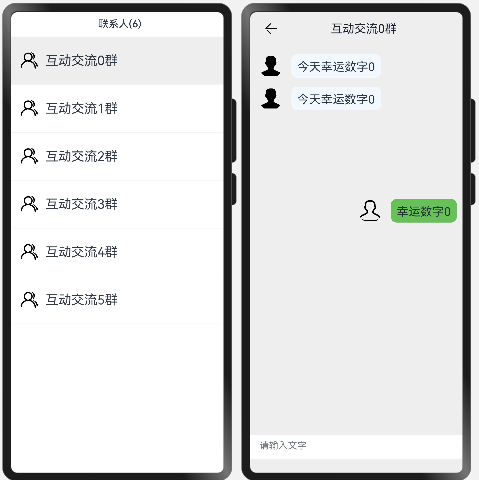
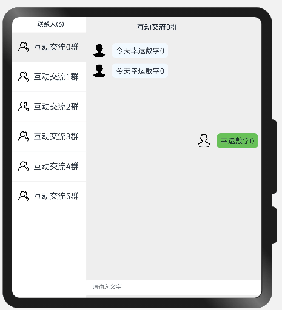

# Navigation如何实现多场景UI适配
## 场景介绍
应用在不同屏幕大小的设备上运行时，往往有不同的UI适配，以聊天应用举例：
* 在窄屏设备上，联系人和聊天区在多窗口中体现。

* 在宽屏设备上，联系人和聊天区在同一窗口体现。

要做好适配，往往需要开发者开发多套代码，以便运行在不同设备上。但是这样耗时耗力，于是ArkUI针对这种场景提供了分栏组件，可以通过一套代码完成不同设别的适配，本例简单介绍下如何使用分栏组件实现上述场景。

## 效果呈现
效果图如下所示：

窄屏设备效果图：

 

宽屏设备效果图：


## 运行环境
本例基于以下环境开发，开发者也可以基于其它适配的版本进行开发：
- IDE：DevEco Studio 3.1 Release
- SDK: Ohos_sdk_public 3.2.12.5(API Version 9 Release)
## 实现思路
想要实现一多效果，所有的页面元素必须在Navigation的容器中展示，Navigation一般作为页面的根容器，包括单页面、分栏和自适应三种显示模式，可通过mode属性设置页面的显示模式。

导航区中使用NavRouter子组件实现导航栏功能，内容页主要显示NavDestination子组件中的内容。

NavRouter是和Navigation搭配使用的特殊子组件，默认提供点击响应处理，不需要开发者自定义点击事件逻辑。NavRouter有且仅有两个根节点，第二个根节点是NavDestination。NavDestination用于显示Navigation组件的内容页。当开发者点击NavRouter组件时，会跳转到对应的NavDestination内容区。


本例涉及一些关键特性以及实现方法如下：
- 创建Navigation组件，同时通过设置mode属性为auto来控制页面显示效果。
- Navigation通过与NavRouter组件搭配使用，实现页面分栏效果。
  
    > NavRouter必须包含两个子组件，其子组件即为实现分栏效果的组件，其中第二个子组件必须为NavDestination（第一个即可理解为为导航栏，第二个组件可理解为内容区）。

- 通过向父组件NavRouter添加子组件NavDestination，创建导航内容区并添加文本。
- 内容区域的补充:根据应用的场景，添加TextArea组件完善内容区。


## 开发步骤
1. 创建Navigation组件，同时通过设置mode属性为auto来控制页面显示（自适应模式下，当设备宽度大于520vp时，Navigation组件采用分栏模式，反之采用单页面模式）。
具体代码如下：
    ```ts
    build() {
        Column() {
            Navigation() {
                ...
            }
                // Navigation组件mode属性设置为auto。自适应模式下，当设备宽度大于520vp时，Navigation组件采用分栏模式，反之采用单页面模式。
                    .mode(NavigationMode.Auto)
            }
            .height('100%')
        }
    ```
2. 通过NavRouter组件创建导航栏：Navigation通过与NavRouter组件搭配实现页面分栏效果。
    * 自定义导航栏NavigationTitle。
    * 添加Navigation子组件NavRoute，创建导航栏。
    * 通过ForEach循环渲染导航栏内容，且导航栏内容通过List组件显示。
    具体代码如下：
        ```ts
        // 自定义导航栏title
        @Builder NavigationTitle(index) {
            Column() {
                Row() {
                    Text('互动交流' + index + '群')
                    .fontColor('#182431')
                    .fontSize(20)
                    }
                }
            .width($r("app.float.titHeightFloat"))
        }

        build() {
            Column() {
                Navigation() {
                    Text('联系人(' + this.arr.length + ')')
                    .fontWeight(500)
                    .margin({ top: 10, right: 10, left: 19 })
                    .fontSize(17)
                    
                    List({ initialIndex: 0 }) {
                        // 通过ForEach循环渲染导航栏内容
                        ForEach(this.arr, (item: number, index: number) => {
                            ListItem() {
                                // 导航组件，默认提供点击响应处理
                                NavRouter() {
                                    // 导航区内容
                                    Column() {
                                        Row() {
                                            Image($r('app.media.icon1'))
                                                .width(35)
                                                .height(35)
                                                .borderRadius(35)
                                                .margin({ left: 3, right: 10 })
                                            Text('互动交流' + item + '群')
                                                .fontSize(22)
                                                .textAlign(TextAlign.Center)
                                        }
                                        .padding({ left: 10 })
                                        .width('100%')
                                        .height(80)
                                        .backgroundColor(this.dex == index ? '#eee' : '#fff')

                                        Divider().strokeWidth(1).color('#F1F3F5')
                                    }.width('100%')

                                    ...

                                }
                                .width('100%')
                            }
                        }, item => item)
                    }
                    .height('100%').margin({ top: 12 })
                }
                //  Navigation组件默认为自适应模式，此时mode属性为NavigationMode.Auto。自适应模式下，当设备宽度大于520vp时，Navigation组件采用分栏模式，反之采用单页面模式。
                .mode(NavigationMode.Auto)
                .hideTitleBar(true)
                .hideToolBar(true)
            }
            .height('100%')
        }
        ```
    
3. 通过添加组件NavDestination，创建内容栏并添加文本。
    NavRouter包含两个子组件，其子组件即为实现分栏效果的组件，其中第二个子组件必须为NavDestination，用于显示导航内容区（第一个即可理解为为导航栏，第二个组件可理解为内容区）；
    内容区部分代码：
    
    ```ts      
    build() {
        Column() {
            Navigation() {
                ...                        
                        
                    // 导航组件，默认提供点击响应处理
                    NavRouter() {
                        // 导航区内容
                        ...
                    
                        // NavRouter组件的子组件，用于显示导航内容区。
                        NavDestination() {
                            // 内容区
                            ForEach([0, 1], (item: number) => {
                                Flex({ direction: FlexDirection.Row }) {
                                    Row() {
                                        Image($r('app.media.icon2'))
                                            .width(40)
                                            .height(40)
                                            .borderRadius(40)
                                            .margin({ right: 15 })
                                        Text('今天幸运数字' + index.toString())
                                            .fontSize(20)
                                            .height(40)
                                            .backgroundColor('#f1f9ff')
                                            .borderRadius(10)
                                            .padding(10)
                                    }
                                    .padding({ left: 15 })
                                    .margin({ top: 15 })
                                }
                            }, item => item)
                            ....                                           
                        }
                        
                        // 设置内容区标题
                        .title(this.NavigationTitle(index))
                    }
            }
            //  Navigation组件默认为自适应模式，此时mode属性为NavigationMode.Auto。自适应模式下，当设备宽度大于520vp时，Navigation组件采用分栏模式，反之采用单页面模式。
            .mode(NavigationMode.Auto)
            .hideTitleBar(true)
            .hideToolBar(true)
        }
        .height('100%')
    }
    ```


4. 内容区域的补充:完善内容区域文本组件。
具体代码块如下：

    ```ts
    ...  
    Column() {
            TextArea({
                placeholder: '请输入文字',
            })
            .placeholderFont({ size: 16, weight: 400 })
            .width('100%')
            .height($r("app.float.heightFloat"))
            .fontSize(16)
            .fontColor('#182431')
            .backgroundColor('#FFFFFF')
            .borderRadius(0)
        }
        .margin({ top: $r("app.float.marHeightFloat") })
        .height($r("app.float.ColHeightFloat"))
        .justifyContent(FlexAlign.End)
        ...               
    ```

## 完整代码
示例完整代码如下：

```ts
@Entry
@Component
struct NavigationExample {
  @State arr: number[] = [0, 1, 2, 3, 4, 5]
  @State dex: number = 0

  @Builder NavigationTitle(index) {
      Column() {
          Row() {
            Text('互动交流' + index + '群')
            .fontColor('#182431')
            .fontSize(20)
            }
        }
    .width($r("app.float.titHeightFloat"))
    }

    build() {
        Column() {
            Navigation() {
                Text('联系人(' + this.arr.length + ')')
                .fontWeight(500)
                .margin({ top: 10, right: 10, left: 19 })
                .fontSize(17)
                List({ initialIndex: 0 }) {
                    // 通过ForEach循环渲染导航栏内容
                    ForEach(this.arr, (item: number, index: number) => {
                        ListItem() {
                            // 导航组件，默认提供点击响应处理
                            NavRouter() {
                                // 导航区内容
                                Column() {
                                    Row() {
                                        Image($r('app.media.icon1'))
                                            .width(35)
                                            .height(35)
                                            .borderRadius(35)
                                            .margin({ left: 3, right: 10 })
                                        Text('互动交流' + item + '群')
                                            .fontSize(22)
                                            .textAlign(TextAlign.Center)
                                    }
                                    .padding({ left: 10 })
                                    .width('100%')
                                    .height(80)
                                    .backgroundColor(this.dex == index ? '#eee' : '#fff')

                                    Divider().strokeWidth(1).color('#F1F3F5')
                                }.width('100%')

                                // NavRouter组件的子组件，用于显示导航内容区。
                                NavDestination() {
                                    ForEach([0, 1], (item: number) => {
                                        Flex({ direction: FlexDirection.Row }) {
                                            Row() {
                                                Image($r('app.media.icon2'))
                                                    .width(40)
                                                    .height(40)
                                                    .borderRadius(40)
                                                    .margin({ right: 15 })
                                                Text('今天幸运数字' + index.toString())
                                                    .fontSize(20)
                                                    .height(40)
                                                    .backgroundColor('#f1f9ff')
                                                    .borderRadius(10)
                                                    .padding(10)
                                            }
                                            .padding({ left: 15 })
                                            .margin({ top: 15 })
                                        }
                                    }, item => item)

                                    Row() {
                                        Text('幸运数字' + item.toString())
                                            .fontSize(20)
                                            .margin({ right: 10 })
                                            .height(40)
                                            .backgroundColor('#68c059')
                                            .borderRadius(10)
                                            .padding(10)
                                        Image($r('app.media.icon3'))
                                            .width(40)
                                            .height(40)
                                            .borderRadius(40)
                                            .margin({ right: 15 })
                                    }
                                    .padding({ left: 15 })
                                    .margin({ top: 150 })
                                    .width('100%')
                                    .direction(Direction.Rtl)

                                    Column() {
                                        TextArea({placeholder: '请输入文字',})
                                            .placeholderFont({ size: 16, weight: 400 })
                                            .width('100%')
                                            .height($r("app.float.heightFloat"))
                                            .fontSize(16)
                                            .fontColor('#182431')
                                            .backgroundColor('#FFFFFF')
                                            .borderRadius(0)
                                    }
                                    .margin({ top: $r("app.float.marHeightFloat") })
                                    .height($r("app.float.ColHeightFloat"))
                                    .justifyContent(FlexAlign.End)
                                }
                                .backgroundColor('#eee')
                                // 设置内容区标题
                                .title(this.NavigationTitle(index))
                            }
                            .width('100%')
                        }
                    }, item => item)
                }
                .height('100%').margin({ top: 12 })
            }
            // Navigation组件mode属性设置为auto。自适应模式下，当设备宽度大于520vp时，Navigation组件采用分栏模式，反之采用单页面模式。
            .mode(NavigationMode.Auto)
            .hideTitleBar(true)
            .hideToolBar(true)
        }
        .height('100%')
    }
}
```
## 参考
[List组件](../application-dev/reference/arkui-js/js-components-container-list.md) 

[Flex组件](../application-dev/reference/arkui-ts/ts-container-flex.md)

[Navigation](../application-dev/reference/arkui-ts/ts-basic-components-navigation.md)

[NavRouter](../application-dev/reference/arkui-ts/ts-basic-components-navrouter.md)

[NavDestination](../application-dev/reference/arkui-ts/ts-basic-components-navdestination.md)

