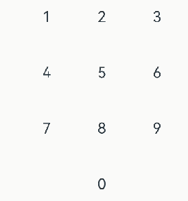
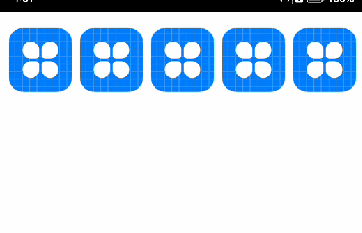
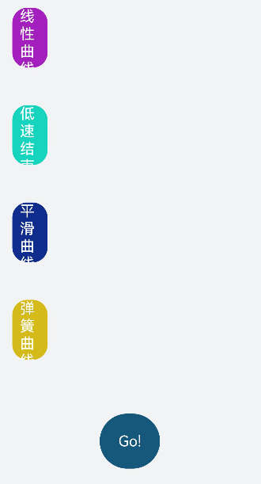

# 属性动画

## 场景介绍
在日常开发过程中，通常会出现因为状态变化导致组件属性值发生变化，如：
- 数字键盘按键时，对应数字按钮背景色加深，呈现被点击效果；放开按键时，呈现取消选中效果,
- UI中图标按下时，图标出现弹性缩放效果,
- 在做数据统计时，随着数据值的变化，统计曲线随之变化等动画效果，
本例将为大家介绍下如何通过属性动画实现上述场景。

## 效果呈现
效果图如下：

| 场景         | 效果图                   |
|------------|-----------------------|
| 场景1：属性动画   |  |
| 场景2：弹性动态 |  |
| 场景3：曲线动画 |  |

## 运行环境
本例基于以下环境开发，开发者也可以基于其他适配的版本进行开发
- IDE: DevEco Studio 3.1 Release
- SDK: Ohos_sdk_public 3.2.12.5(API Version 9 Release)

## 场景1：属性动画
### 实现思路
本实例涉及到的主要特性及其实现方案如下：
* 通过Column、Grid、button、Text等关键组件以及visibility属性搭建UI局框架，以及渲染数字按钮。
* 设置状态变量flag,用来控制属性状态的变化，同时向Button组件添加onTouch事件，更新按钮的当前状态，从而可以根据监听到的按钮状态加载对应的动画效果。
  * 默认状态为按钮放开状态（flag为false）。
  * 当按钮按下时，更新按钮的状态（flag：false -> true）。
  * 当按钮放开时，更新按钮的状态（flag：true -> false）。
* 根据按钮组件的按下/放开状态，通过三元运算判断，使用属性动画更新按钮的选中/取消效果。
  * 当按钮按下时，加载属性动画：按钮被选中效果。
  * 当按钮放开时，加载属性动画：按钮取消选中效果。
### 开发步骤
针对实现思路中所提到的内容，具体关键开发步骤如下：
1. 通过Column、Grid、button、Text等关键组件以及visibility属性搭建UI框架，以及渲染数字按钮。
   具体代码如下：
   
   ```ts
   
     private numGrid: number[] = [1, 2, 3, 4, 5, 6, 7, 8, 9, -1, 0, -1]
   
     build() {
       Row() {
         Column() {
           Grid() {
             //通过ForEach循环遍历，显示数字数字按钮
             ForEach(this.numGrid, (item, index) => {
               GridItem() {
                 Button() {
                   Text(`${item}`)
                     .fontSize(30)
                 }
                 .backgroundColor('#fff')
                 .width(100)
                 .height(100)
                 // item为-1时，数字按钮不显示
                 .visibility(item == -1 ? Visibility.Hidden : Visibility.Visible)
               }
             }, item => item)
           }
           .columnsTemplate('1fr 1fr 1fr')
           .rowsTemplate('1fr 1fr 1fr 1fr')
           .columnsGap(10)
           .rowsGap(10)
           .width(330)
           .height(440)
         }
         .width('100%')
         .height('100%')
       }
     }
   
   ```
   
2. 设置状态变量flag,用来控制属性状态的变化，同时向Button组件添加onTouch事件，更新按钮的当前状态，从而可以根据监听到的按钮状态加载对应的动画效果。

    具体代码如下：

    ```ts
    //状态变量flag，用于监听按钮按下和放开的状态，默认至为false（放开状态）
    @State flag: boolean = false;
    ...
    .onTouch((event:TouchEvent) => {
        //当按钮按下时，更新按钮的状态（flag：false -> true）
        if (event.type == TouchType.Down) {
            this.flag = true
            this.currIndex = index
        }
        //当按钮放开时，更新按钮的状态（flag：true -> false）
        if (event.type == TouchType.Up) {
            this.flag = false
        }
    })
    ```


3. 根据按钮组件的按下/放开状态，通过三元运算判断并更新按钮背景色。

    具体代码如下：

    ```ts
    Button(){
        ...
        // 当按钮被按下(flag变更为true)时，当前按钮backgroundColor属性变更（"#fff" -> "#D2C3D5" ）
        // 当按钮被放开(flag变更为false)时，当前按钮backgroundColor属性变更（"#D2C3D5" -> "#FFF" ）
        .backgroundColor(this.flag && this.currIndex == index ? '#D2C3D5' : '#fff')
        .animation({
            duration: 200
        })
    }
    ```


### 完整代码
```ts
@Entry
@Component
struct Index {
  private currIndex: number = -1
  private numGrid: number[] = [1, 2, 3, 4, 5, 6, 7, 8, 9, -1, 0, -1]
  //状态变量flag，用于监听按钮按下和放开的状态，默认至为false（放开状态）
  @State flag: boolean = false;

  build() {
    Row() {
      Column() {
        Grid() {
          ForEach(this.numGrid, (item, index) => {
            GridItem() {
              Button() {
                Text(`${item}`)
                  .fontSize(30)
              }
               // 当按钮被按下(flag变更为true)时，当前按钮backgroundColor属性变更（"#fff" -> "#D2C3D5" ）
			   // 当按钮被放开(flag变更为false)时，当前按钮backgroundColor属性变更（"#D2C3D5" -> "#FFF" ）
              .backgroundColor(this.flag && this.currIndex == index ? '#D2C3D5' : '#fff')
              .animation({
                duration: 200
              })
              .width(100)
              .height(100)
              .visibility(item == -1 ? Visibility.Hidden : Visibility.Visible)
              .onTouch((event:TouchEvent) => {
                //当按钮按下时，更新按钮的状态（flag：false -> true）
                if (event.type == TouchType.Down) {
                  this.flag = true
                  this.currIndex = index
                }
                //当按钮放开时，更新按钮的状态（flag：true -> false）
                if (event.type == TouchType.Up) {
                  this.flag = false
                }
              })
            }
          }, item => item)
        }
        .columnsTemplate('1fr 1fr 1fr')
        .rowsTemplate('1fr 1fr 1fr 1fr')
        .columnsGap(10)
        .rowsGap(10)
        .width(330)
        .height(440)
      }
      .width('100%')
      .height('100%')
    }
  }
}
```

## 场景2：弹性动效
### 实现思路
针对弹性动效，涉及到的主要特征分为两部分：
* 组件描绘：先通过List、ListItem、Image等组件将控件表描绘出来。
* 组件状态变化：设置状态变量downFlag，控制按钮的当前状态；同时向Column组件添加onTouch事件，监听组件的当前状态。
    * 组件默认状态为放开状态（downFlag：false）。
    * 当按下Image组件时，更新组件的状态为true。
    * 当放开Image组件时，更新组件的状态为false。
* 动画播放：使用属性动画绘制Image组件不同状态下的曲线动画。
    * 组件按下，触发第一阶段缩小动效，370ms内将组件横纵尺寸均缩小到原尺寸的80%。
    * 组件放开，触发第二阶段放大动效，在370ms内将控件从当前尺寸恢复到原尺寸。
### 开发步骤
针对实现思路中所提到的内容，具体关键开发步骤如下：
1. 先通过List、ListItem、Image等组件将控件表描绘出来。

   具体代码如下：

   ```ts
   private arr: number[]=[1,2,3,4,5]
   
   ...
   List({space:10}){
         ForEach(this.arr,(item,index)=>{
           ListItem(){
               Image($r("app.media.app_icon"))
                 .width(80)
                 .height(80)
           }
         })
       }
       .margin({top:20})
       .padding({left:20})
       .listDirection(Axis.Horizontal)
   ```

2. 设置状态变量downFlag，控制Image组件的当前状态，同时向Image组件添加onTouch事件，获取并更新组件的当前状态，从而可以根据监听到的组件状态加载对应的动画效果。
  具体代码如下：

    ```ts
    ...
    // 状态变量downFlag，用于监听Image组件按下和放开的状态
    @State downFlag: boolean = false;
    ...
    // 添加onTouch事件，监听状态
    .onTouch((event: TouchEvent) => {
        // 当Column组件按下时，组件的状态更新为true
        if (event.type == TouchType.Down) {
          this.downFlag = true 
        // 当Column组件按下时，组件的状态更新为false
        } else if (event.type == TouchType.Up) {
          this.downFlag = false
        }
      })
    ```

3. 根据Image组件的按下/放开状态，呈现不同的弹性效果（按下时组件缩小，动画以阻尼曲线的形式缩小至0.8倍，放开时组件动画以阻尼曲线的形式恢复至初始大小）。
  具体代码如下：

    ```ts
   ···
   Image($r("app.media.app_icon"))
     // 当downFlag状态为按下（true）时，组件在370ms内缩小至0.5倍；当downFlag状态为放开（false）时，组件在370ms内恢复至初始大小；
    .scale(this.downFlag ? { x: 0.8, y: 0.8 } : { x: 1, y: 1 })
    .animation({
       duration: 370,
       curve: Curve.Friction
   })
    ```

### 完整代码
```ts
@Entry
@Component
struct Index {
  // 状态变量downFlag，用于监听Image组件按下和放开的状态
  @State downFlag: boolean = false;
  private arr: number[]=[1,2,3,4,5]
  private curIndex : number = -1

  build() {
    List({space:10}){
      ForEach(this.arr,(item,index)=>{
        ListItem(){
            Image($r("app.media.app_icon"))
              // 当downFlag状态为按下（true）时，组件在370ms内缩小至0.8倍；当downFlag状态为放开（false）时，组件在370ms内恢复至初始大小；
              .scale(this.downFlag && this.curIndex == index ? { x: 0.8, y: 0.8 } : { x: 1, y: 1 })
              .animation({
                duration: 370,
                curve: Curve.Friction
              })
              .width(80)
              .height(80)
                // 添加onTouch事件，监听状态
              .onTouch((event: TouchEvent) => {
                // 当Image组件按下时，组件的状态更新为true
                if (event.type == TouchType.Down) {
                  this.downFlag = true
                  this.curIndex = index
                  // 当Image组件按下时，组件的状态更新为false
                } else if (event.type == TouchType.Up) {
                  this.downFlag = false
                }
              })
        }
      })
    }
    .margin({top:20})
    .padding({left:20})
     // 列表排列方向水平
    .listDirection(Axis.Horizontal)
  }
}
```

## 场景3：曲线动画
曲线动画可以使用不同的曲线属性，呈现出不同的动画。
ArkUI中，曲线动画有两种使用方式，一种是直接使用Curve类型的枚举，一种是导入ohos.curve模块并使用模块内定义的接口/属性。

### 实现思路
* 设置自定义变量item，用于存放不同类型的曲线，本案例中主要有以下类型曲线：
  1. Curve类型的枚举:
     * Linear：表示动画从头到尾的速度都是相同的。
     * EaseInOut：表示动画以低速开始和结束，CubicBezier(0.42, 0.0, 0.58, 1.0)。
     * Smooth：平滑曲线，cubic-bezier(0.4, 0.0, 0.4, 1.0)。
  2. ohos.curve导入:
     * springCurve类的弹簧曲线。
* 通过Flex、Column、button组件将UI布局以及框架搭建。
* Column组件内部通过ForEach，遍历展示每条曲线。
* 设置状态变量flag，监听当前button的状态，同时向button组件添加onClick事件，更新按钮的状态，从而可以根据监听到的按钮状态加载对应的动画效果。
* 向Text组件添加width属性，根据按钮的状态，在同一周期内，通过width的变化呈现曲线的不同动画。
### 开发步骤
1. 设置自定义变量item，用于存放不同类型的曲线。
  
    具体代码如下：
    
    ```ts
    private items: object[] = [
        {
          color: '#a320bf',
          title: '线性曲线',
          // curve类型曲线：表示动画从头到尾的速度都是相同的。
          curve: Curve.Linear,
        },
        {
          color: '#17d4be',
          title: '低速结束曲线',
          // curve类型曲线：表示动画以低速结束
          curve: Curve.EaseInOut,
        },
        {
          color: '#0e2d8c',
          title: '平滑曲线',
          // curve类型曲线：平滑曲线
          curve: Curve.Smooth,
        },
        {
          color: '#d4bb19',
          title: 'Curves.spring',
          // ohos.curve导入的弹簧曲线,以初速度为20的弹簧进行平移
          curve: Curves.springCurve(20, 1, 1, 1.2),
        },
    ```
    
2. 通过Flex、Column、button组件将UI布局以及框架搭建。

    具体代码如下：

    ```ts
     Flex({ direction: FlexDirection.Column, justifyContent: FlexAlign.Start, alignItems: ItemAlign.Center }) { 
         Column({ space: 50 }) {
            ...
         }
         .alignItems(HorizontalAlign.Start)
         .width('100%')
         .padding({ left: 12, right: 12, top: 22, bottom: 22 })
         
         Button(){
            Text("Go!")
            .fontSize(20)
            .fontColor('#fff')
        }
        .borderRadius(20)
        .fontColor('#FFFFFF')
        .fontSize('12fp')
        .fontWeight(FontWeight.Bolder)
        .backgroundColor('#15587c')
        .padding(25)
        .margin({top:50}) 
      }
      .height('100%')
      .backgroundColor('#F1F3F5')
      .padding({ left: '3%', right: '3%' })
    ```

3. Column组件内部通过ForEach，遍历展示每条曲线。

    具体代码如下：

    ```ts
    ForEach(this.items, (item, index) => {
      Text(item['title'])
        .fontSize(20)
        .fontColor('#FFFFFF')
        .height(80)
        .textAlign(TextAlign.Start)
        .backgroundColor(item['color'])
        .borderRadius(20)
        .padding({left:10})
    }, item => JSON.stringify(item))
        
    ```

4. 设置状态变量flag，监听当前button的状态，同时向button组件添加onClick事件，更新按钮的状态，从而可以根据监听到的按钮状态加载对应的动画效果。

    具体代码如下：

    ```ts
    //状态变量flag，用于监听按钮按下状态
    @State flag: boolean = true
    ...
    Button(){
    }
    // 通过点击事件，反转flag的值
    .onClick(() => {
          this.flag = !this.flag
        }) 
    ```

5. 向Text组件添加width属性，根据按钮的状态，在同一周期内，呈现不同效果的曲线动画。

    具体代码如下：

    ```ts
    ForEach(this.items, (item, index) => {
      Text(item['title'])
         ...
        // 当flag为true时，width为15%；当flag为false时，width为95%
        .width(this.flag ? '15%': '95%')
        .animation({ duration: 2000, curve: item['curve'] })
    }, item => JSON.stringify(item)) 
    ```

### 完整代码
```ts
import Curves from '@ohos.curves';

@Entry
@Component
struct Index {
  // 状态变量flag，用于监听按钮按下状态
  @State flag: boolean = true
  private items: object[] = [
    {
      color: '#a320bf',
      title: '线性曲线',
      // curve类型曲线：表示动画从头到尾的速度都是相同的。
      curve: Curve.Linear,
    },
    {
      color: '#17d4be',
      title: '低速结束曲线',
      // curve类型曲线：表示动画以低速结束
      curve: Curve.EaseInOut,
    },
    {
      color: '#0e2d8c',
      title: '平滑曲线',
      // curve类型曲线：平滑曲线
      curve: Curve.Smooth,
    },
    {
      color: '#d4bb19',
      title: '弹簧曲线',
      // ohos.curve导入的弹簧曲线动画,以初速度为20的弹簧进行平移
      curve: Curves.springCurve(20, 1, 1, 1.2),
    },
  ]

  build() {
    Flex({
      direction: FlexDirection.Column,
      justifyContent: FlexAlign.Start,
      alignItems: ItemAlign.Center
    }) {
      Column({ space: 50 }) {
        ForEach(this.items, (item, index) => {
          Text(item['title'])
            .fontSize(20)
            .fontColor('#FFFFFF')
            // 当flag为true时，width为15%；当flag为false时，width为95%；
            .width(this.flag ? '15%': '95%')
            .height(80)
            .textAlign(TextAlign.Start)
            .backgroundColor(item['color'])
            // 2s之内完成动画展示，每条动画曲线按照item['curve']去展示
            .animation({ duration: 2000, curve: item['curve'] })
            .borderRadius(20)
            .padding({left:10})
        }, item => JSON.stringify(item))
      }
      .alignItems(HorizontalAlign.Start)
      .width('100%')
      .padding({ left: 12, right: 12, top: 22, bottom: 22 })

      Button(){
        Text("Go!")
          .fontSize(20)
          .fontColor('#fff')
      }
      .borderRadius(20)
      .fontColor('#FFFFFF')
      .fontSize('12fp')
      .fontWeight(FontWeight.Bolder)
      .backgroundColor('#15587c')
      .padding(25)
      .margin({top:50})
      // 通过点击事件，反转flag的值
      .onClick(() => {
        this.flag = !this.flag
      })
    }
    .height('100%')
    .backgroundColor('#F1F3F5')
    .padding({ left: '3%', right: '3%' })
  }
}
```


​          

## 参考

[属性动画](../application-dev/reference/arkui-ts/ts-animatorproperty.md#属性动画)

[Curve](../application-dev/reference/arkui-ts/ts-appendix-enums.md#curve)

[弹簧曲线动画](../application-dev/ui/arkts-spring-animation.md)

[Flex布局](../application-dev/reference/arkui-ts/ts-universal-attributes-flex-layout.md)

[Listitem](../application-dev/reference/arkui-ts/ts-container-listitem.md)

[List](../application-dev/reference/arkui-ts/ts-container-list.md)